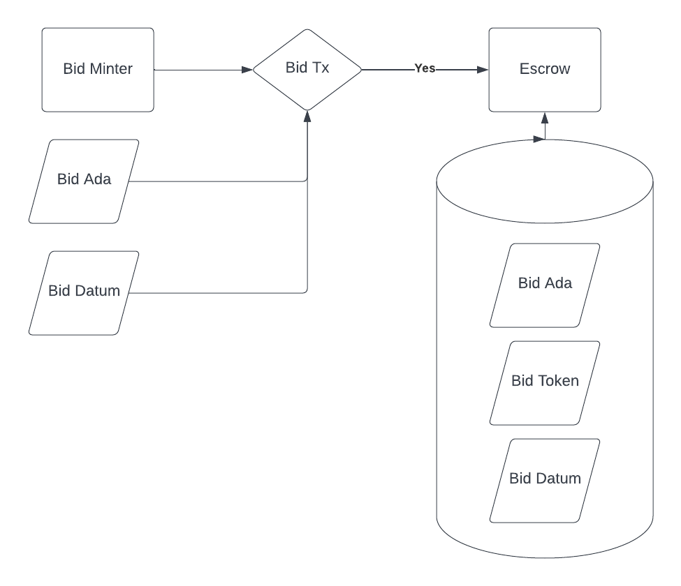
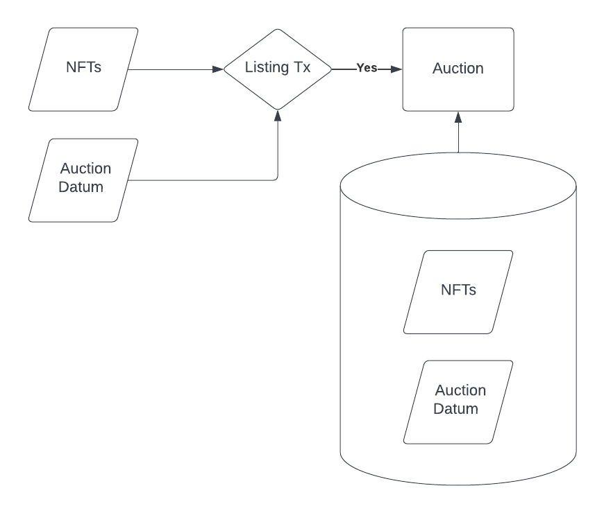
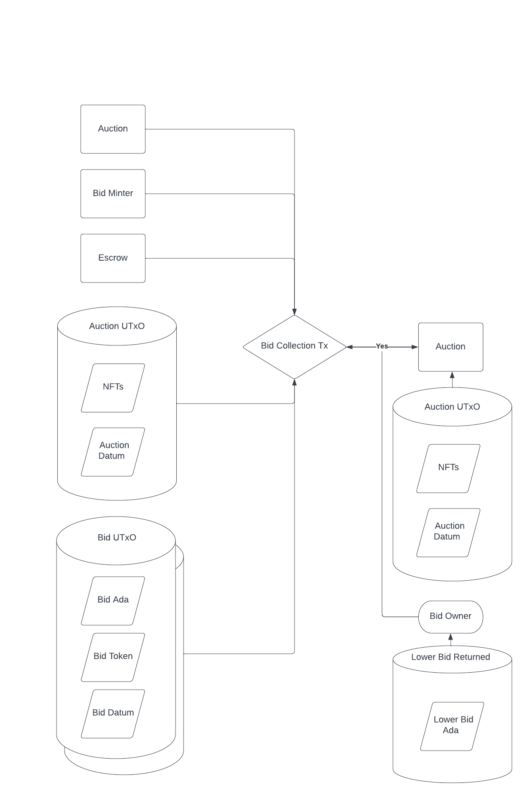

# A NFT Auction Smart Contract

This repo contains the source for three Plutus smart contracts. The contracts work together to create a high throughput NFT auction system. The source for the smart contract is located in `src`.

The repo also contains an executable for compiling the smart contract in `app/Main.hs`.

## Building

First source either the testnet or mainnet environment variables.

For testnet

```
$ source scripts/envars/testnet-env.envars
```

For mainnet

```
$ source scripts/envars/mainnet-env.envars
```

The environment variable files set `CARDANO_NODE_SOCKET_PATH` to the path of the appropriate Daedalus socket file (either Testnet Daedalus or the regular mainnet Daedalus). It you run a `cardano-node` on your own you should set this environment variable to your socket file location after sourcing the environment variable file.

First create the wallets and get the protocol parameters.

```
$ ./scripts/wallets/make-all-wallets.sh
$ ./scripts/query-protocol-parameters.sh
```

Next, run:

```bash
scripts/compile.sh
```

This will make the files in `testnet/*.addr` or `mainnet/*.addr`.

## Overall Design

The main design goal of this auction system is to faciliate bids without contention.

Bids require the creation of a bid token, which triggers the minting script. The minting script ensures the output datums is correctly storing the validity interval of the transaction. In this way we ensure bids do not occur after the auction deadline.

Additionally, the minting script validates that the token name is the output address. Don't worry if this seems unusual at this point. It will make more sense what this accomplishing later.

The next piece is an escrow script. This scripts allows users to cancel their bid, but they must burn there bid token.

Alternatively, the bid can be spent if the auction contract is one of the inputs.

In this way, the validation for unlocking is delegated to auction contract.



The auction contract maintains the initial listing state setup by the seller. Additionally it tracks the highest bid and expiration.



Updating the highest bid requires spending a bid token stored on the escrow contract. The auction contract ensures the bid token's name is the escrow contracts hash. If this is the case the bid token could not have left the escrow contract after minting, which means a user is unable to tamper with the datum that was stored during minting. In other words, the conditions that the bid minting contract checked and still valid.

The auction contract can unlock multiple bids at once and will ensure the highest bid is reflected in the output.



## Example Transactions

Example transactions can be found in `scripts/core`. The scripts are used by other scripts in `scripts/happy-path` which demonstrates how to start, bid and close the auction.

## Example Redeemers and Datums

Redeemers for all the smart contracts are found in `scripts/shared-redeemers`.

Here is the Haskell type of the Datum

```haskell
data Auction = Auction
  { aSeller            :: PubKeyHash
  , aDeadline          :: POSIXTime
  , aBatcherDeadline   :: POSIXTime
  , aMinBid            :: Integer
  , aPayoutPercentages :: (M.Map PubKeyHash Integer)
  , aHighBid           :: (Maybe Bid)
  , aEscrowValidator   :: ValidatorHash
  , aValue             :: Value
  , aBidMinterPolicyId :: CurrencySymbol
  }
```

A crucial note is the `aPayoutPercentages` field which is used to determine how to distribute the winning bid. Instead of going entirely to seller it is split up using the percentages in the map, as described in detail below.

## Understanding the Price Calculation

When the auction is finished, assuming there is winning bid, the funds are distributed to multiple parties as described by the percentages map.

The map is collection of pairs of public key hash and percentage. The percentages are stored as integers times 1000, so 2.5% would be stored as 25.

The calculation to determine how much to give each party is not as straightforward as one would imagine because of minimum Ada UTxO requirements.

Regardless of the percentage, every participant recieves a minimum of 1 Ada.

For example, if there were three (seller, marketplace and royalty) users and percentages were 95%, 2.5% and 2.5%, 10,000,000 lovelaces would distributed as follows:

```
seller: 8,000,000
marketplace: 1,000,000
royalty: 1,000,000
```

This is in contrast to the split as dicated by the percentages directly, which would have been:

```
seller: 9,500,000
marketplace: 250,000
royalty: 250,000
```

Here is another example with percentages were 80%, 15% and 5% with 10,000,000 lovelaces:

```
seller: 7,578,948
marketplace: 1,421,052
royalty: 1,000,000
```

The extra 500,000 that was needed to give the royalty user 1 Ada, was taken equally from the seller and marketplace portions.

The exact calculation is as follows.

The percentages are sorted least to greatest. For each percentage the percentage is multiplied times the current total amount and divided by 1000 (remember the percentages are multiplied times a 10 so 2.5% is 25). If the portion is less than 1 Ada it is set to 1 Ada. The portion for this user is subtracted from the current total and their percentage is subtracted from the total percentages.

The loop starts again, with a new current total and a new current total percentages. The next percentage is adjusted by dividing by the new total percentage.

This process continues until the last element, which just get's whatever is left over.

Let's revisit our example above to see how it works.

The first time through the loop we multiple 50 * 10,000,000 and divide by 1,000 to get 500,000. This is less than 1 Ada (1,000,000) so we set the portion this user gets to 1 Ada. We subtract 1 Ada from the total to get 9 Ada and subtract 50 from the total percent (times 10) to get 950.

For the next iteration we multiple 150 * 9,000,000 and divide by 950 to get 1,421,052. This is greater than 1 Ada so we don't have to adjust it. We subtract 1,421,052 from 9,000,000 to get 7,578,947. We subtract 150 from 950 to get 800.

For the final iteration through the loop we just give the user the rest which is 7,578,947.

##

## Unit Tests

Because the divided up the price to various participants is so complicated there are unit tests to cover this logic specifically.

Run the unit tests by calling:

```bash
$ cabal test
```

## Full System Testing Prerequistes

Before testing you need to make sure you have `cardano-cli` installed and on your path, and it must be version 1.31.0 or greater. You will also need the json utility `jq` as well as `cardano-cli` helper `cardano-cli-balance-fixer` which can be downloaded here: https://github.com/Canonical-LLC/cardano-cli-balance-fixer


# Manual Testing

We will walk through the process of manually testing a start, bid, outbid and close flow.

After following the setup steps above, first make sure that the `~/$BLOCKCHAIN_PREFIX/seller.addr` has Ada.

Start by minting a token for the auction:

```bash
$ scripts/mint-0-policy.sh
```

Wait for the next slot:

```bash
$ scripts/wait/until-next-block.sh
```

You can now view the minted token in the `seller`'s wallet:

```bash
$ scripts/query/seller.sh
```

Now start the auction by calling:

```bash
$ scripts/happy-path/lock-tx.sh 400000 0
```

This will create a auction that expires in 400 seconds. The `0` is namespace so we can have more than one auction going at a time.

Wait for the next slot:

```bash
$ scripts/wait/until-next-block.sh
```

You can now view the token at the smart contract address:

```bash
$ scripts/query/auction.sh
```

Make sure that the `~/$BLOCKCHAIN_PREFIX/seller.addr` has over 11 Ada.

Now create a bid:

```bash
$ scripts/happy-path/bid-1-tx.sh
```

Wait for the next slot, and query the escrow script address

```bash
$ scripts/query/escrow.sh
```

It should show the additional 10 Ada bid is now stored there.

Make sure that the `~/$BLOCKCHAIN_PREFIX/buyer1.addr` has over 33 Ada.

Now create a bid, that replaces the first bid:

```bash
$ scripts/happy-path/bid-2-tx.sh
```

Wait for the next slot, and query the escrow script address

```bash
$ scripts/query/escrow.sh
```

Now collect the bids

```bash
$ scripts/query/collect-2-tx.sh
```

Wait for the next slot:

```bash
$ scripts/wait/until-next-block.sh
```

Query the auction contract:

```bash
$ scripts/query/auction.sh
```

This should show the new bid's Ada.

Query the `buyer` address:

```bash
$ scripts/query/buyer.sh
```

This should show the old bid Ada has been returned.

At this wait for the auction to expire.

Make sure that the `~/$BLOCKCHAIN_PREFIX/marketplace.addr` has over 3 Ada.

When the time is right, call close:

```bash
$ scripts/happy-path/close-tx.sh
```

Wait for the next slot, and then check that the token is in `buyer1`'s wallet:

```bash
$ scripts/query/buyer-1.sh
```

and the bid is in the sellers wallet:

```bash
$ scripts/query/seller.sh
```

and the marketplace:

```bash
$ scripts/query/marketplace.sh
```
and

```bash
$ scripts/query/royalty.sh
```

# Full System Tests

There are three large system tests that cover the main use cases and potential vulnerabilities we are aware of. The tests can be run on mainnet or testnet.

They take a long time to run, around 20 minutes, and can fail if the testnet is overloaded.

Luckily running them is easy:

```bash
$ ./scripts/tests/all.sh
```

The tests will start running. If the script errors one of the tests has failed.

If the scripts pass one must still verify that assets were transfered correctly at each step.

In the `temp/accounts/diff` directory, there will be subdirectories for each test flow. Within these directories are folders for each test step. If assets were transfer, there will be `json` files the account difference.

For instance after the first step to lock assets at the script address, the following `json` files are written:

```bash
$ cat temp/accounts/diffs/start-bid1-bid2-close.sh/0-1/sc.json
{"":{"":1758582},"d6cfdbedd242056674c0e51ead01785497e3a48afbbb146dc72ee1e2":{"123456":1}}
$ cat temp/accounts/diffs/start-bid1-bid2-close.sh/0-1/seller.json
{"":{"":-1942827},"d6cfdbedd242056674c0e51ead01785497e3a48afbbb146dc72ee1e2":{"123456":-1}}
```

This shows that the smart contract (`sc`), received a non-native token (`d6cfdbedd242056674c0e51ead01785497e3a48afbbb146dc72ee1e2.123456`) and 1758582 lovelaces.

As expected, the seller lost _at least_ this much. Notice it lost more Ada, because of fees.

# Activity Token Minting and Exchanging

Whenever purchases are completed an activity token is minted and sent to the exchanger smart contract address.

The activity tokens can be exchanged for reward tokens, by spending the exchanger UTxOs.

The exchanger uses a linear formula for the distribution schedule. A counter of the number of activity tokens exchanged thus far is maintained on an UTxO with a special NFT. The schedule is a simple linear schedule where the slope and intercept can be configured at compile time. See `scripts/compile.sh` for the arguments that are used.

Additionally the reward tokens must be part of the UTxO that stores the counter NFT.

The example script `scripts/happy-path/exchanger.sh` shows the process of exchanging an activity token for reward token.

The tests `tests/start-bid1-close.sh` executes the whole process including minting the NFT, minting the reward tokens, completing a auction purchase and collecting rewards.

# Direct Sale Contract

Both sellers lifting NFTs and buyers listing offers are handled by the same contract `direct-sale.plutus`, with the source file `src/Canonical/DirectSale.hs`.

The input datum is given by the types:

```haskell
data Payout = Payout
  { pAddress :: PubKeyHash
  , pValue   :: Value
  }

data CloseInfo = CloseInfo
  { ciTimeout         :: Maybe POSIXTime
  -- ^ An optional timeout for expiration as an absolute
  --   time in milliseconds
  , ciEmergencyCloser :: Maybe PubKeyHash
  -- ^ The emergency closer public key hash
  , ciValue           :: Value
  -- ^ The value listed that must be returned if closed
  }

data SwapInput = SwapInput
  { siOwner             :: PubKeyHash
  -- ^ Used for the signer check on Cancel
  , siSwapPayouts       :: [Payout]
  -- ^ Divvy up the payout to different address for Swap
  , siCloseInfo         :: Maybe CloseInfo
  -- ^ Optional data for closing the listing on the behalf
  --   of the owner
  , siActivityTokenName :: TokenName
  -- ^ The Activity token name
  , siActivityPolicyId  :: CurrencySymbol
  -- ^ The Activity policy id
  , siBoostTokenName    :: TokenName
  -- ^ The Boost token name
  , siBoostPolicyId     :: CurrencySymbol
  -- ^ The Boost policy id
  , siBoostPayoutPkh    :: PubKeyHash
  -- ^ The Boost payout public key hash
  }
```

and the redeemer has the type:

```haskell
data BuyerInput = Cancel | Buy [Payout] | Close | EmergencyClose
```
